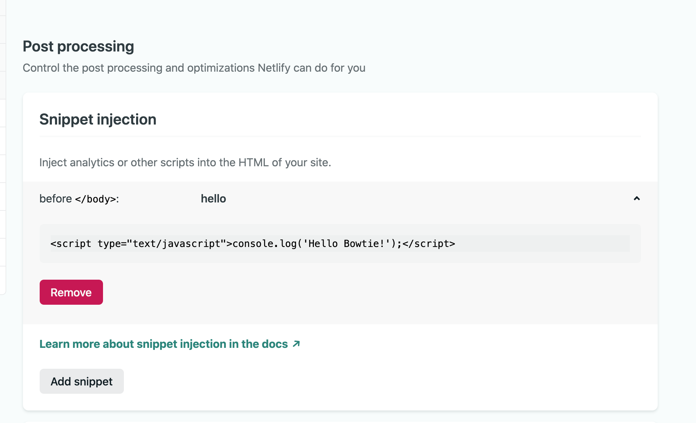

# CICD pipeline with CircleCI and Netlify

## Set up a simple web page

To get start with, I downloaded the very initial sample app in Netlify, which is a very simple html page.


## **Setup Netlify**

It is easy to use to set up a new site in Netlify.


## **Setup Circle CI** 

It is also fast and convenient to set up the Circle CI project in Circle CI.


**CI/CD Pipeline**

The pipeline will be a merge request in GitHub triggering Circle CI to start pipeline, in which it will call Netlify Cli to deploy to production. All these configs are set in `.circleci/config.yml`

**.circleci/config.yml**

```yaml
workflows: # decide the jobs to run.
  version: 2
  deploy:
    jobs:  #here we only have one job, deploy. Because html does not need to build
      - deploy: #name of the job is self defined
          filters:
            branches:
              only: main #it will triggered when I merge into main branch.
```

```yaml
jobs:
  deploy:
    working_directory: ~/project/website
    docker:
      - image: circleci/node:lts # choose image with node to run this job
    environment:
      NETLIFY_AUTH_TOKEN: Xjb13Vkj9ruyzpLbl9zyFV7nFsxA2YEWV8tCZLxiGIg  # pass netlify auth token for Netlify Cli to do things on specific site
    steps:
      - checkout
      - run: 
          name: variable_substitution
          command: |
            echo "No need to build, it is a html page. Now substitute CIRCLE_BUILD_NUM."
            echo $CIRCLE_BUILD_NUM
            sed "s/CIRCLE_BUILD_NUM/$CIRCLE_BUILD_NUM/" index.html > index1.html 
            cat index1.html
            ls
            mv index1.html index.html
            ls
      - run:
          name: deploy
          command: |
            cat index.html
            yarn run deploy
```

**Script**

- Sometimes when the page need to show the build number from CircleCI, it can be done by using  `sed`command to replace CIRCLE_BUILD_NUM in index.html.

  To substitute the built-in variable in Circle CI, CIRCLE_BUILD_NUM,  `sed` can replace the keyword `CIRCLE_BUILD_NUM` with value of CIRCLE_BUILD_NUM.

- In deploy step, I call npm netlify cli commands to deploy, netlify auth token is needed to do so, therefore NETLIFY_AUTH_TOKEN is generated in Netlify UI > Site Setting.


- I also defined some commands in package.json to call Netlify Cli. Only deploy command will be used in Circle CI pipeline (`yarn run deploy`).

**package.json**

```json
{
  "name":"website-deploy",
  "license": "MIT",
  "private": true,
  "dependencies": {
    "netlify-cli": "^6.7.1"
  },
  "scripts": {
    "login": "netlify login",
    "link": "netlify link --id 60ec17e7-d954-4cd2-aecf-28e2d09620ba",
    "deploy":"netlify deploy --prod --site 60ec17e7-d954-4cd2-aecf-28e2d09620ba --dir ."
  }
}
```


**Obversatory Mozilla**


**Snippet Injection**

To add the snippet injection in Netlify, I went to site settings > build and deploy > add it. 




In Inspector of my broswer, I can see the script in html body.

**.circle/config.yml**

Run these commands in the job's script.

```bash
sed "s/CIRCLE_BUILD_NUM/$CIRCLE_BUILD_NUM/" index.html > index1.html
mv index1.html index.html
```


It will replace the CIRCLE_BUILD_NUM here in `index.html`

```html
  <p>
  		CircleCI Build Number: CIRCLE_BUILD_NUM
  </p> 
```


This is what it looks like in the pipeline console.


*Final deployed site: https://wizardly-perlman-05240c.netlify.app/*